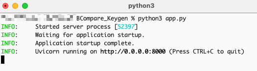
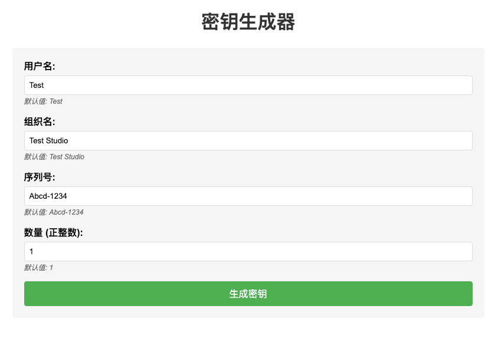
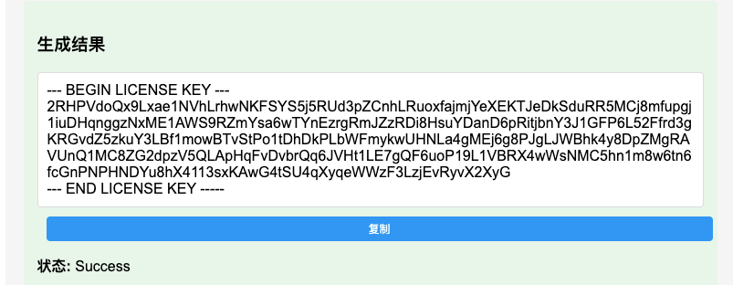
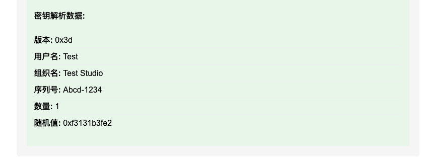
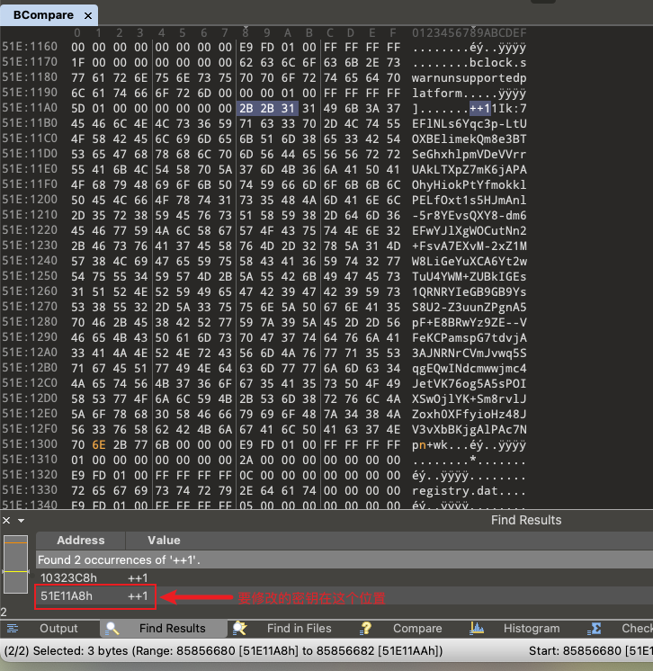

# Beyond Compare 5 Keygen
Written in Python 3 to generate registration keys for Beyond Compare 5.x (as of version 5.1 ver 31016).

## Prerequisites
Use binary tools like 010 Editor to modify the built-in RSA key inside the Beyond Compare executable.

Before modification:
```
++11Ik:7EFlNLs6Yqc3p-LtUOXBElimekQm8e3BTSeGhxhlpmVDeVVrrUAkLTXpZ7mK6jAPAOhyHiokPtYfmokklPELfOxt1s5HJmAnl-5r8YEvsQXY8-dm6EFwYJlXgWOCutNn2+FsvA7EXvM-2xZ1MW8LiGeYuXCA6Yt2wTuU4YWM+ZUBkIGEs1QRNRYIeGB9GB9YsS8U2-Z3uunZPgnA5pF+E8BRwYz9ZE--VFeKCPamspG7tdvjA3AJNRNrCVmJvwq5SqgEQwINdcmwwjmc4JetVK76og5A5sPOIXSwOjlYK+Sm8rvlJZoxh0XFfyioHz48JV3vXbBKjgAlPAc7Np1+wk
```

After modification (changed the end of the string from `p1+wk` to `pn+wk`):
```
++11Ik:7EFlNLs6Yqc3p-LtUOXBElimekQm8e3BTSeGhxhlpmVDeVVrrUAkLTXpZ7mK6jAPAOhyHiokPtYfmokklPELfOxt1s5HJmAnl-5r8YEvsQXY8-dm6EFwYJlXgWOCutNn2+FsvA7EXvM-2xZ1MW8LiGeYuXCA6Yt2wTuU4YWM+ZUBkIGEs1QRNRYIeGB9GB9YsS8U2-Z3uunZPgnA5pF+E8BRwYz9ZE--VFeKCPamspG7tdvjA3AJNRNrCVmJvwq5SqgEQwINdcmwwjmc4JetVK76og5A5sPOIXSwOjlYK+Sm8rvlJZoxh0XFfyioHz48JV3vXbBKjgAlPAc7Npn+wk
```


## Generating License Keys

```shell
git clone https://github.com/garfield-ts/BCompare_Keygen.git
cd BCompare_Keygen
pip3 install -r requirements.txt
# For Python 3.7 and earlier, manually install typing_extensions
# DO NOT DO THIS IF YOU'RE USING A NEWER VERSION OF PYTHON
pip3 install typing_extensions==4.7.1
```

### Generate license keys via web page
```shell
python3 app.py
```



After starting the service, visit http://localhost:8000/ to see the page, which is automatically generated by AI.



Click `Generate Key` to create a license key using the provided parameters; click the `Copy` button to copy the generated key to the clipboard.



The page also displays detailed parameters corresponding to the license key at the bottom for research and study.



### Generate license keys via the command line

```shell
python3 keygen.py
```

You will get a usable license key:
```
--- BEGIN LICENSE KEY ---
3E49oaH5wnhovRZf6cWWLySVVc4KKbxdm1n7cqyr9vrT5nU7WR36DNN7f2sxbXVJr9FWq3f4n7ujX4yac8ine6ZfNhKotpoidW5kWvV4AXQWYMuKdD6BtGrtf8EP1QYYy4NWYVi1JsMNALBQvLHBqYyosxrhgqwQvsGBVoogswP9CcKMtFh3CWrBW3fco2K66ghcNGXAoc3TCu3GFVW7PPh2Pcakb1kz2xQArSL8FVci4Xjadh4fr6qmHiazhEB5CHHHvkLDtdomz6SNa9643X9Jr59x32WYgZgMZopX1yWH2TuCersBB8y8rjqcvdxE2UkFTtXi4kvv13f2KSNw6SpKbkoPvU
--- END LICENSE KEY -----
```

The default generated license key uses the following information:
```
Version: 0x3d
Serial: Frog-Cool
Username: ILikeFrogs
Company: Ribbit Company
Max users: 1
```

You can customize the license key information by providing relevant parameters.


## Using the key to register
Open Beyond Compare 5; you will see a prompt 'Evaluation mode error'. Click the `Enter Key` button to go to the registration page:


Paste the license key generated by the script into the input box and click `OK` to activate.


## Notes

1. On macOS, the RSA key is in the file `/Applications/Beyond Compare.app/Contents/MacOS/BCompare`; on Windows, the RSA key is in the `BCompare.exe` file.

2. After modifying the key on macOS, you must disable SIP (System Integrity Protection) or Beyond Compare will crash with an “Beyond Compare unexpectedly quit” error. See this article for details: https://sspai.com/post/55066

3. In the macOS version, there are two RSA keys in the `BCompare` file — you should modify the second one. The Windows version has only one key; modify it directly.



## TODO

- Integrate binary patch functionality
- ……
